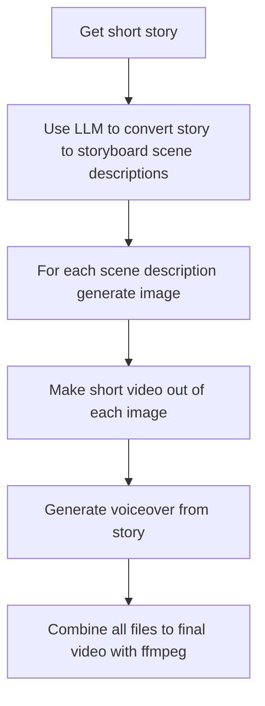

# story-to-video

This is an experiment with an automated pipeline from short story text to video. This project was created during the Runway Hackathon 2026. For taking part in the Hackathon, Runway provided me with free credits.

## Requirements

- A Runway Developer account with sufficient credits.
- LLM for creation of storyboard scene descriptions.

## Installation

```bash
npm i
```

## Demo

The resulting demo made with the help of the scripts in this
repository can be watched here: 

https://player.mux.com/MUiHW6Ch02n01e1qRWOt2IcDJ32Ywsjo7f00sIv5RPF9WM

## Pipeline



## Storyboard Generation

For generating the storyboard from the short story text you 
can use any capable LLM.

There is an example prompt under `prompts/storyboard-prompt.txt`.

## Image Generation

Use `scene-to-image.mjs` to generate an image by entering each 
individual scene description from the LLM.

## Video Generation

Use `image-to-video.mjs` to generate a short video from each 
image of the previous step.

## Text to Speech

Use `text-to-speech.mjs` to generate the voiceover from the text.

## Final Video

Use ffmpeg to combine the separate files (video files and audio files)
into final video.

Example command:

```bash
ffmpeg \
  -i video1.mp4 \
  -i video2.mp4 \
  -i video4.mp4 \
  -i video5.mp4 \
  -i audio1.mp3 \
  -i audio2.mp3 \
  -filter_complex "\
    [0:v:0]tpad=stop_mode=clone:stop_duration=10[v0]; \
    [1:v:0]tpad=stop_mode=clone:stop_duration=10[v1]; \
    [2:v:0]tpad=stop_mode=clone:stop_duration=20[v2]; \
    [3:v:0]tpad=stop_mode=clone:stop_duration=20[v3]; \
    [v0][v1][v2][v3]concat=n=4:v=1:a=0[v]; \
    [4:a:0][5:a:0]concat=n=2:v=0:a=1[a]" \
  -map "[v]" \
  -map "[a]" \
  -c:v libx264 \
  -c:a aac \
  -pix_fmt yuv420p \
  -shortest \
  final.mp4
```

## Credits

Thanks to Runway for hosting the Hackathon and providing generous credits.

